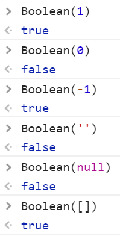

###浏览器内核
> 作为前端开发，我们会使用HTML/CSS/JS编写代码，编写代码的时候要遵循一些规范(W3C)
>  
> 浏览器开发商开发的浏览器，目的就是为了按照W3C的规范，识别出开发者编写的代码，并且在页面中绘制出开发者预想的页面和效果(GPU：显卡)，我们把浏览中识别代码绘制页面的东西成为‘浏览器的内核或者渲染引擎’
>  
> 浏览器兼容：
> 1、W3C发布的规范都是开发者们不断尝试总结下来的产物，举个栗子：谷歌浏览器开发了一个新的CSS属性（border-radius）可以让开发者快速实现盒子圆角
> -webkit-border-radius
> 火狐浏览器发现这个功能很好用，也实现了这个属性
> -moz-border-radius
> ...
> W3C把它融入到规范的时候
> border-radius
>  
> 2、每个浏览器为了彰显自己的不一样，不按照标准来，但是把标准中规定的效果用另外一种方式实现了
> window.getComputedStyle
> currentStyle
> 我们写的时候写两套

--------------------------
###JavaScript
> ECMAScript(ES)：规定了JS的一些基础核心的知识（变量、数据类型、语法规范、操作语句等）  3/5==6/7
> DOM：document object model 文档对象模型，里面提供了一些属性和方法，可以让我们操作页面中的元素
> BOM：browser object model 浏览器对象模型，里面提供了一些属性和方法，可以让我们操作浏览器

###变量和常量
> 变量：值是可以变的
> 常量：值是不可变的

```javascript
//=>JS中定义变量的方式
//var 变量名 = 值; (ES6中定义变量使用let)
var num = 12;
var str = 'zhufeng';

//=>JAVA等后台语言定义变量比较严谨，JS比较松散
//int num = 12;
//float num = 12.5;
//double num = 3.141592654;

console.log(num);//=>12 变量其实只是一个无意义的名字，它所代表的意义都是其存储的那个值

num = 13;//=>让原有的NUM变量存储的值修改为13（变量只能代表一个值）
```

```javascript
//=>任何一个具体的数据值都是常量，例如：12就是一个常量

//=>和变量类似，我们设置一个常量（也是一个名字），给其存储一个值，但是这个存储的值不能修改
const num = 12; //=>定义一个常量NUM，给他存储了12
num = 13; //=>Uncaught TypeError: Assignment to constant variable. 常量存储的值是不能修改的
```
-------

###JS中的命名规范
1、 JS中严格区分大小写
```javascript
var test = 'zhufeng';
var Test = 'peixun';
console.log(test); //=>'zhufeng' test和Test是两个不同的变量
```
2、遵循国际命名规则`驼峰命名法`
> 第一个单词首字母小写，其余每一个有意义单词首字母大写
```javascript
var studentInfo;
//命名使用英文单词，不要使用拼音
//不是所有单词都能简写，我们需要保证大家看到名字后知道所代表的意思

info：information 信息
init：Initialization 初始化
add / insert / create ：增加创建插入
remove / rm / clear / del / delete：删除
update：修改
get / query / select：查询获取
...
```

3、命名的时候可以使用 `$、_、数字、字母`，但是数字不能作为名字的第一位
```javascript
var student_info;
var $xxx; //=>一般都是应用JQ获取到的值
var _xxx; //=>一般这样的情况代表变量是一个全局或者公用的变量
```

4、JS中很多的词都是有特殊含义的，我们这些词叫做`关键字`；现在没有特殊含义，以后可能会作为关键词的，我们叫做`保留字`；而关键字和保留字都不可以随便用来命名；


------
###JS中的数据类型
> - 基本数据类型(值类型)
>   + number：数字
>   + string：字符串
>   + boolean：布尔
>   + null：空对象指针
>   + undefined：未定义
> - 引用数据类型
>   + object对象数据类型
>       + {}普通对象
>       + []数组
>       + /^$/正则
>       + ....
>   + function函数数据类型

```javascript
12 12.5 -12.5 0
'zhufeng'  "珠峰" =>单双引号包裹起来的都是字符串(单双引号没有区别)
true false =>布尔类型：只有两个值
null
undefined

{name:'zfpx',age:8}
[12,23,34]
/^-?(\d|([1-9]\d+))(\.\d+)?$/
function fn(){}
...
```

这么多数据类型JS如何的去检测呢?
- typepof：检测数据类型的运算符
- instanceof：检测某个实例是否属于这个类
- constructor：获取当前实例的构造器
- Object.prototype.toString.call：获取当前实例的所属类信息

**`typeof`**
> 使用typeof检测，返回的结果是一个字符串，字符串中包含的内容证明了值是属于什么类型的
>  
> [局限性]
> 1、typeof null不是'null'而是'object'：因为null虽然是单独的一个数据类型，但是它原本意思是空对象指针，浏览器使用typeof检测的时候会把它按照对象来检测
> 2、使用typeof无法具体细分出到底是数组还是正则，因为返回的结果都是'object'
```javascript
typeof 12 =>"number"

var num=13;
typeof num =>"number"
```


腾讯的面试题：
```javascript
console.log(typeof typeof []);
typeof [] ->"object"
typeof "object" ->"string"
```

-----
###布尔
**`Boolean()`**
> 把其它数据类型的值转换为布尔类型
>  
> 只有 `0、NaN、空字符串、null、undefined` 这五个数据值转换为布尔类型的false，其余的都会变为true


**`!`**
> !=：不等于 
> 叹号在JS中还有一个作用：`取反`，先把值转换为布尔类型，然后再去取反


**`!!`**
> 在一个叹号取反的基础上在取反，取两次反相当于没有做操作，但是却已经把其它类型值转换为布尔类型了，和Boolean是相同的效果


-----
###字符串
> 在JS中 单引号  和 双引号 包起来的都是字符串
```javascript
12 ->number
'12' ->string
'[12,23]' ->string
```
常用方法：
charAt  charCodeAt
substr substring slice
toUpperCase  toLowerCase
indexOf lastIndexOf
split
replace
match
...

------
###number数字
> 0 12 -12 12.5，JS中多增加了一个number类型的数据：`NaN`
> typeof NaN   ->"number"

**`NaN`**
> not a number：不是一个数，但是属于number类型
>  
> NaN == NaN ：false，NaN和任何其它值都不相等

**`isNaN()`**
> 用来检测当前这个值是否是非有效数字，如果不是有效数字检测的结果是true，反之是有效数字则为false
```javascript
isNaN(0)  ->false
isNaN(NaN) ->true

isNaN('12') ->false  当我们使用isNaN检测值的时候，检测的值不是number类型的，浏览器会默认的把值先转换为number类型，然后再去检测

isNaN([]) ->false
isNaN(true) ->false
```

**`Number()`**
> 把其它数据类型值转化为number类型的值
```javascript
Number('12') ->12
Number('12px') ->NaN  在使用Number转换的时候只要字符串中出现任何一个非有效数字字符，最后的结果都是NaN

Number(true) ->1
Number(false) ->0

Number(null) ->0
Number(undefined) ->NaN

Number([]) =>把引用数据类型转换为number，首先需要把引用数据类型转为字符串(toString)，在把字符串转换为number即可 例如：[]->'' ''->0
Number([12]) =>[12]->'12'  '12'->12
Number([12,23]) =>[12,23]->"12,23"  "12,23"->NaN

Number({name:'zhufeng'}) =>NaN
Number({}) =>NaN
```

**`parseInt()`**
> 也是把其它数据类型值转换为number，和Number方法在处理字符串的时候有所区别
```javascript
Number('12px') ->NaN
parseInt('12px') ->12
parseInt('12px13') ->12 提取规则：从左到右依次查找有效数字字符，直到遇见非有效数字字符为止（不管后面是否还有，都不找了），把找到的转换为数字
parseInt('px12') ->NaN
```

**`parseFloat()`**
> 在parseInt的基础上可以识别小数点
```javascript
parseInt('12.5px') ->12
parseFloat('12.5px') ->12.5
```

> 课后思考：parseInt常用的只需要传递一个值做参数即可，但是它支持多个参数，回去后扩展其它参数的意思,例如：parseInt('12.5',10)

---------------
###null和undefined
> null：空，没有
> undefined：未定义，没有
>  
> ''：空字符串，没有
> 0：也可以理解为没有

`空字符串和null的区别`
> 都是去种树
> 空字符串属于挖了个坑，但是没有种任何东西
> null是连坑都没挖
>  
> 空字符串相对于null来说开辟了内存，消耗了那么一丢丢的性能

`null和undefined的区别`
> null一般都是暂时没有，预期中以后会有的（可能以后也没有达到预期）：在JS中null一般都是手动先赋值为null，后期我们在给其赋具体值
>  
> undefined：完全没在预料之内的
>  
> 一孝是个帅气的男孩子
> 他现在的女朋友是null
> 他的男朋友是undefined

-----------
###对象数据类型object
> var obj = {name:'珠峰',age:8};
> 每一个对象都是由零到多组`属性名(key键):属性值(value值)`组成的，或者说有多组键值对组成的，每一组键值对中间用逗号分隔
>  
> 属性：描述这个对象特点特征的
>  
> 对象的属性名是字符串或者数字格式的，存储的属性值可以是任何的数据类型
> 
> `对象名.属性名：忽略了属性名的单双引号`
> `对象名[属性名]：不能忽略单双引号`

```javascript
var obj = {name:'珠峰',age:8,friend:['习大大','彭妈妈'],0:100};

//=>获取某个属性名对应的属性值
obj.name
obj['name']
//->如果属性名是数字如何操作
obj.0 语法不支持
obj[0] / obj['0']  两种都可以支持
//->如果操作的属性名在对象中不存在，获取的结果是undefined
obj.sex ->undefined

//=>设置/修改：一个对象的属性名是不能重复的（唯一性），如果之前存在就是修改属性值的操作，反之不存在就是新设置属性的操作
obj.sex = '男';
obj['age'] = 9;

//=>删除
//->假删除:让其属性值赋值为null，但是属性还在对象中
obj.sex=null;
//->真删除：把整个属性都在对象中暴力移除
delete obj.sex;
```

思考题：obj[age]和obj['age']有什么样的区别?
```javascript
var obj = {name:'珠峰',age:8};
var age = 'zhufeng';
obj[age]
obj['age']
```

课后作业：
2017年第12期JS正式群 628094770
http://pan.baidu.com/s/1pJuVLX5

