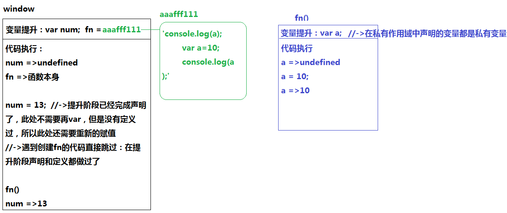

[TOC]
#JS中变量提升详解
@(201712)
##数据类型的核心操作原理
> JS中的数据类型
> - 基本数据类型（值类型）
>    + number
>    + string
>    + boolean
>    + null
>    + undefined 
> - 引用数据类型
>    + 对象
>       + {}普通对象
>       + [] 数组
>       + /^$/ 正则
>       + Math 对象数据类型的
>       + ... 
>    + 函数
>       + function 普通函数
>       + 类
>       + ...

JS代码运行在浏览器中，是因为浏览器给我们提供了一个供js代码执行的环境 -> `全局作用域(window/global)`

```javascript
var a=12;
var b=a;
b=13;
console.log(a);

var o={name:'BigSpinach'};
var p=o;
p.name='周啸天';
console.log(o.name);

var m={name:'BigSpinach'};
var n=m;
n={name:'我是BigSpinach'};
console.log(m.name);

function fn(){
    var ary=Array.prototype.slice.call(arguments);
	return eval(ary.join('+'));
}
fn(12,23,34,45,56);
```

###值类型
> 直接按值操作，例如：var a=12; 直接把12这个值赋值给变量a（让a变量和12这个值建立了链接关系）

###对象数据类型
> 在JS中遇到对象，会严格按照如下的步骤操作：
> 1、浏览器为其开辟一个新的内存空间，为了方便后期可以找到这个空间，浏览器给空间分配一个16进制的地址
> 2、按照一定顺序，分别的把对象键值对存储到内存空间中
> 3、把开辟内存的地址赋值给变量（或者其它的东西），以后变量就可以通过地址找到内存空间，然后进行一些操作

###函数的操作
> 创建函数
>  1、先开辟一个新的内存空间（为其分配了一个16进制的地址）
>  2、把函数体中编写的js代码当做`字符串`存储到空间中（函数只创建不执行没有意义）
>  3、把分配的地址赋值给声明的函数名（function fn 和 var fn 操作原理其实相同，都是在当前作用域中声明了一个名字，此处两个名字是重复的）
> 
> 执行函数
> 目的：执行函数体中的代码
> 1、函数执行的时候，浏览器会形成一个新的私有作用域（只能执行函数体中的代码）供函数体中的代码执行
> 2、执行代码之前，先把创建函数存储的那些字符串变为真正的js表达式，按照从上到下的顺序在私有作用域中执行
>  
> 一个函数可以被执行N次，每一次执行相互之间互不干扰（后面会学习两者之间建立的间接关系）
> 
> 形成的私有作用域把函数体中的私有变量等都包裹起来了（保护起来了），在私有作用域中操作私有变量和外界没关系，外界也无法直接的操作私有变量，我们把函数执行形成的这种保护机制叫做`闭包`

**`学习：知其然而知其所以然`**

###JS中的堆栈内存
> **栈内存**
> 俗称叫做作用域（全局作用域/私有作用域）
> - 为js代码提供执行的环境(执行js代码的地方)
> - 基本数据类型值是直接存放在栈内存中的
>  
> **堆内存**
> 存储引用数据类型值的（相当于一个存储的仓库）
> - 对象存储的是键值对
> - 函数存储的是代码字符串

在项目中，我们的内存越少性能越好，我们需要把一些没用的内存处理掉
[堆内存]
var o={};  当前对象对应的堆内存被变量o占用着呢，堆内存是无法销毁的
o=null;  null空对象指针（不指向任何的堆内存），此时上一次的堆内存就没有被占用了，谷歌浏览器会在空闲时间把没有被占用的堆内存自动释放(销毁/回收)

[栈内存]
一般情况下，函数执行形成栈内存，函数执行完，浏览器会把形成的栈内存自动释放；有时候执行完成，栈内存不能被释放？
全局作用域在加载页面的时候执行，在关掉页面的时候销毁；


##变量提升
> 在`当前作用域`中，js代码自上而下执行之前，浏览器首先会把所有带`var/function`关键字的进行提前的`声明或者定义`
> 
> 声明(declare)：var num; 在当前作用域中吼一嗓子我有num这个名了
> 定义(defined)：num=12; 把声明的名字赋一个值
>  
> **带var关键字的只是提前的声明一下；带function关键字的在变量提升阶段把声明和定义都完成了；**

```javascript
console.log(num);
console.log(fn);	
//fn();//->放在前面执行也可以	
var num=13;
function fn(){
	console.log(a);	
	var a=10;
	console.log(a);	
}
fn();
console.log(num);
```


###定义变量的时候带var和不带var的区别?
> [带var]
> 在当前作用域中声明了一个变量，如果当前是全局作用域，也相当于给全局作用域设置了一个属性叫做a
>  
> [不带var]
> 在全局作用域中，如果不带var，仅仅是给全局对象设置了一个新的属性名（把window.省略了）

```javascript
//=>变量提升：var a;  <=> window.a=undefined;
console.log(a);//->undefined
var a = 12;//<=> window.a=12
console.log(a);//->12
console.log(window.a);//->window['a'] 在“全局作用域”中,我们声明一个变量，相当于给全局对象window增加了一个属性名
```

```javascript
console.log(a);//=>Uncaught ReferenceError: a is not defined
console.log(window.a);//=>undefined
a = 12; //<=> window.a=12
console.log(a);//=>12 <=>window.a
console.log(window.a);//=>12
```
> 以后项目中，如果你的目的是创建变量，最好不要省略var，这样会严谨一些


###作用域链
> 函数执行形成一个私有的作用域（保护私有变量），进入到私有作用域中，首先变量提升（声明过的变量是私有的），接下来代码执行
> 1、执行的时候遇到一个变量，如果这个变量是私有的，那么按照私有处理即可
```javascript
function fn() {
    //=>[私有作用域]
    //变量提升：var a; (私有变量)
    console.log(a);//->undefined
    var a = 12;
    console.log(a);//->12
}
fn();
console.log(a);//=>Uncaught ReferenceError: a is not defined 闭包机制:私有作用域保护里面的私有变量不受外界的干扰
```
> 2、如果当前这个变量不是私有的，我们需要向它的上级作用域进行查找，上级如果也没有，则继续向上查找，一直找到window全局作用域为止，我们把这种查找机制叫做**`作用域链`**
> 1）如果上级作用域有这个变量，我们当前操作的都是上级作用域中的变量（假如我们在当前作用域把值改了，相当于把上级作用域中的这个值给修改了）
> 2）如果上级作用域中没有这个变量(找到window也没有)：
> 变量 = 值 ：相当于给window设置了一个属性，以后再操作window下就有了
> alert(变量)：想要输出这个变量，但是此时是没有的，所以会报错
```javascript
function fn() {
    //console.log(a);//->Uncaught ReferenceError: a is not defined
    a = 12;//<=>window.a=12
    console.log(a);//=>12
}
fn();
console.log(a);//=>12
```

练习：
```javascript
//=>变量提升：var x; var y; fn=AAAFFF111;
console.log(x, y);//=>undefined*2
var x = 10,
    y = 20;//=>x=10  y=20
function fn() {
    //=>[私有作用域]
    //=>变量提升：var x; (x是私有变量)
    console.log(x, y);//=>undefined 20
    var x = y = 100;//=>x=100(私有)  y=100(全局)
    console.log(x, y);//=>100 100
}
fn();
console.log(x, y);//=>10 100

//---------------
// var x=10,
//     y=20;
// var x=10;
// var y=20;

//----------------
// var x = y = 100;
// var x = 100;
// y = 100;//->此处的Y是不带var的
```

###只对等号左边的进行变量提升
> =：赋值，左边是变量，右边都应该是值
```javascript
//=>之前
i%2===0?item.className='c1':item.className='c2';
//=>现在
item.className=i%2===0?'c1':'c2';
```

```javascript
//=>匿名函数：函数表达式（把函数当做一个值赋值给变量或者其它内容）
oDiv.onclick=function(){} //<=>oDiv.onclick=aaafff000
```
> 只对等号左边进行变量提升，右边是值，不会提前声明什么的
```javascript
//=>变量提升：var fn;
console.log(fn);//->undefined
var fn = function () {

};
console.log(fn);//->函数本身
```

> 真实项目中，应用这个原理，我们创建函数的时候可以使用函数表达式的方式：
> 1、因为只能对等号左边的进行提升，所以变量提升完成后，当前函数只是声明了，没有定义，想要执行函数`只能放在赋值的代码之后执行`（放在前面执行相当于让undefined执行，会报错的）
> 2、这样让我们的代码逻辑更加严谨，以后想要知道一个执行的函数做了什么功能，只需要向上查找定义的部分即可（不会存在定义的代码在执行下面的情况）
```javascript
sum();//=>Uncaught TypeError: sum is not a function
var sum = function () {

};

fn();
function fn() {

}
```


###不管条件是否成立都要进行变量提升
> 不管条件是否成立，判断体中出现的var/function都会进行变量提升；但是在最新版浏览器中， function声明的变量只能提前声明不能定义了（前提：函数是在判断体中）
```javascript
console.log(num);//->undefined
console.log(fn);//->undefined
if (1 === 1) {
    var num = 12;
    function fn() {

    }
}
```
> 代码执行到条件判断地方
> [条件不成立]
> 进入不到判体中，赋值的代码执行不了，此时之前声明的变量或者函数依然是undefined
>  
> [条件成立]
> 进入条件判断体中的第一件事情不是代码执行，而是把之前变量提升没有定义的函数首先定义了（进入到判断体中函数就定义了：迎合ES6中的块级作用域）
```javascript
if (1 === 1) {
    console.log(num);//=>undefined
    console.log(fn);//=>函数体本身
    var num = 12;
    function fn() {}
    console.log(num);//=>12
    console.log(fn);//=>函数体本身
}
```
> 老版本浏览器不是这样处理的：不管条件是否成立，都要进行变量提升（和新版不一样的地方，新版本function只是声明，老版本function依然是声明+定义）
```javascript
//=>变量提升：没有
f = function () {return true;};
g = function () {return false;};
~function () {
    //=>[私有作用域]
    //变量提升：g=undefined (不管条件是否成立都要进行变量提升，但是新版本的浏览器只对函数进行声明)
    if (g() && [] == ![]) {//=>Uncaught TypeError: g is not a function
        f = function () {return false;};
        function g() {return true;}
    }
}();
console.log(f());
console.log(g());
```

###关于重名的处理
> 在变量提升阶段，如果名字重复了，不会重新的进行声明，但是会重新的进行定义（后面赋的值会把前面赋的值给替换掉）
```javascript
//=>变量提升：fn=aaafff111 (=aaafff222) (=aaafff333) (=aaafff444)
fn();//->4
function fn() {console.log(1);}
fn();//->4
function fn() {console.log(2);}
fn();//->4
var fn=13;//->fn=13
fn();//->13() Uncaught TypeError: fn is not a function
function fn() {console.log(3);}
fn();
function fn() {console.log(4);}
fn();
```

**`自从学了预解释，从此节操是路人`**