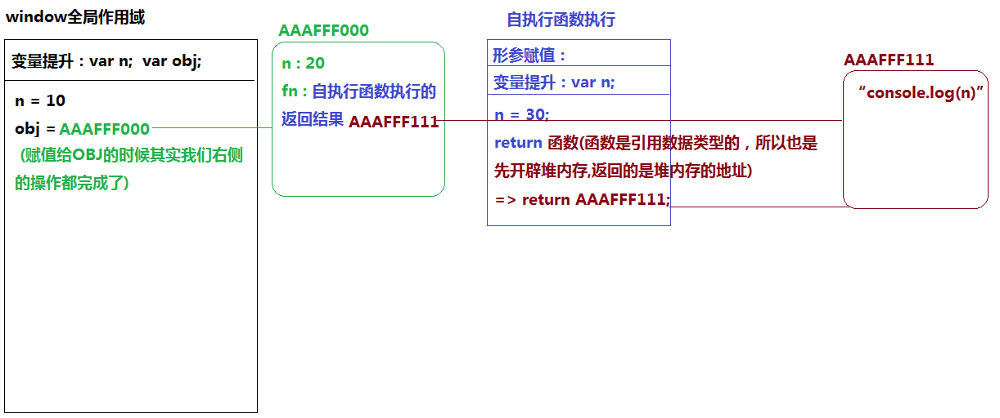
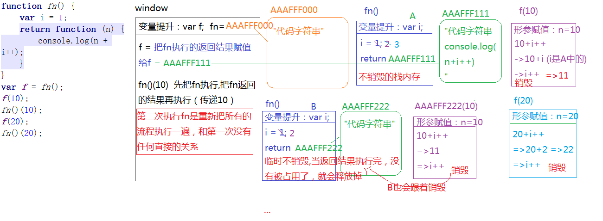
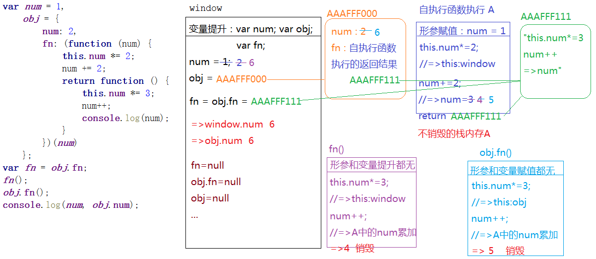

#作用域[scope]
@(201712)

> [栈内存]
> 全局作用域：window
> 私有作用域：函数执行
> 块级作用域：使用let创建变量存在块级作用域
>  
> [作用域链]
> 当前作用域代码执行的时候遇到一个变量，我们首先看一下它是否属于私有变量，如果是当前作用域私有变量，那么以后在私有作用域中在遇到这个变量都是操作私有的（`闭包：私有作用域保护私有变量不受外界干扰`）；如果不是私有的变量，向其上级作用域查找，也不是上级作用域私有的，继续向上查找，一直到window全局作用域为止，我们把这种`向上一级级查找的机制叫做作用域链`；全局下有，操作的就是全局变量，全局下没有（设置：给全局对象window增加了属性名 && 获取：报错）

###查找私有变量
> JS中的私有变量有且只有两种
> - 在私有作用域变量提升阶段，声明过的变量（或者函数）
> - 形参也是私有变量
```javascript
function fn(num1,num2){
	var total = num1+num2;
	return total;
}
var result = fn(100,200);
```
> 函数执行形成一个新的私有作用域
> 1、形参赋值
> 2、变量提升
> 3、代码自上而下执行
> 4、当前栈内存（私有作用域）销毁或者不销毁
```javascript
//=>全局变量提升：var x; var y; var z; fn=AAAFFF000;
var x = 10,
    y = 20,
    z = 30;
function fn(x, y) {
    //=>[私有作用域]
    //=>形参赋值：x=10 y=20 (x/y都是私有变量)
    //=>变量提升：var x(忽略的,已经存在x这个名字了)
    console.log(x, y, z);//=>z不是私有变量是全局变量 10 20 30
    var x = 100;//=>私有的x=100
    y = 200;//=>私有的y=200
    z = 300;//=>全局的z=300
    console.log(x, y, z);//=>100 200 300
}
fn(x, y, z);//=>FN执行传递的是实参(实参都是值) fn(10,20,30)
console.log(x, y, z);//=>10 20 300
```

```javascript
function fn(b) {
    //=>[私有作用域]
    //=>形参赋值：b=1 (私有变量)
    //=>变量提升：b=aaafff111 (此处赋值操作替换了形参赋值的内容)
    console.log(b);//=>函数
    function b() {
        //=>[私有作用域]
        //=>形参赋值和变量提升都没有
        console.log(b);//=>函数
    }
    b();
}
fn(1);
```

###如何查找上级作用域
> 函数执行形成一个私有的作用域(A)，A的上级作用域是谁，和他在哪执行的没关系，主要看他是在哪定义的，在哪个作用域下定义的，当前A的上级作用域就是谁；
```javascript
var n = 10;
function sum() {
    console.log(n);
}
//sum();//=>10
~function () {
    var n = 100;
    sum();//=>SUM的宿主环境是当前自执行函数形成的私有作用域
}();
```

```javascript
var n = 10;
var obj = {
    n: 20,
    fn: (function () {
        //->上级作用域：全局作用域
        var n = 30;
        return function () {
            //->上级作用域：自执行函数
            console.log(n);
        }
    })()
};
obj.fn();//=>30
```


###闭包作用（保护）
> 形成私有作用域，保护里面的私有变量不受外界的干扰
>  
> jQuery：常用的JS类库，提供了很多项目中常用的方法（兼容所有浏览器）
> Zepto：小型JQ，专门为移动端开发准备的
```javascript
//=>JQ代码片段
(function(window){
	var jQuery=function(){
		...
	};
	...
	
	window.jQuery=window.$=jQuery;
})(window);

jQuery()
$()

//=>Zepto的代码片段
var Zepto=(function(){
	var Zepto=function(){
		...
	};
	...
	return Zepto;
})();
var $=Zepto;
Zepto();
$();
```
> 真实项目中，我们利用这种保护机制，实现团队协作开发（避免了多人同一个命名，导致代码冲突的问题）
```javascript
//=>A
~function(){
	//=>A写的代码
	function fn(){
		...
	}
	window.fn=fn;
}();

//=>B
~function(){
	//=>B写的代码
	function fn(){}
	
	//=>B想要调取A写的fn
	window.fn();
}();
```

###闭包作用（保存）
> 函数执行形成一个私有作用域，函数执行完成，形成的这个栈内存一般情况下都会自动释放
>  
> 但是还有二般情况：函数执行完成，当前私有作用域（栈内存）中的某一部分内容被栈内存以外的其它东西（变量/元素的事件）占用了，当前的栈内存就不能释放掉，也就形成了不销毁的私有作用域（里面的私有变量也不会销毁）

`i++和++i的区别`
> i++：先拿原有i的值和其它值进行运算，运算完成后在自身累加1
> ++i：先自身累加1，然后拿累加完成的结果和其它值进行运算
```javascript
var i=5;
console.log(5+i++);//->10  5+(i++) 加括号也是先运算在累加1
console.log(i);//->6

i=5;
console.log(5+(++i));//->11
console.log(i);//->6
```

> 函数执行形成一个私有作用域，如果私有作用域中的部分内容被以外的变量占用了，当前作用域不销毁
> 
> [形式]
> 函数执行返回了一个`引用数据类型堆内存的地址`（并且堆内存隶属于这个作用域），在外面有一个变量接收了这个返回值，此时当前作用域就不能销毁（想要销毁，只需要让外面的变量赋值为null，也就是不占用当前作用域中的内容了）

```javascript
function fn() {
    var i = 1;
    return function (n) {
        console.log(n + i++);
    }
}
var f = fn();
f(10);//->11
fn()(10);//->11
f(20);//->22
fn()(20);//->21
```


##this
> 当前函数执行的主体（谁执行的函数this就是谁）
>  
> 函数外面的this是window，我们一般都研究函数内的this指向问题
>  
> **`this是谁和函数在哪定义的以及在哪执行的没有任何的关系`**

----

> 在JS非严格模式下（默认模式就是非严格模式 ）
> 1、自执行函数中的this一般都是window
```javascript
var obj={
	fn:(function(){
		//this->window
		return function(){}
	})()
};
```
> 2、给元素的某个事件绑定方法，当事件触发执行对应方法的时候，方法中的this一般都是当前操作的元素本身
```javascript
oBox.onclick=function(){
	//this->oBox
}
```
> 3、还有一种方式可以快速区分this：当方法执行的时候，看看方法名前面是否有`点`，有`点`，`点`前面是谁this就是谁，没有`点`this一般都是window

```javascript
var obj = {
    name: 'obj',
    fn: function () {
        console.log(this);
    }
};
obj.fn();//->this:obj
var f = obj.fn;
f();//->this:window
```

----
> 在JS严格模式下（让JS更加严谨）
> 开启严格模式：在当前作用域的第一行加上`"use strict"`，开启严格模式，那么当前作用域下再执行的JS代码都是按照严格模式处理的
```javascript
"use strict";
//=>当前JS代码都开启了严格模式（包含了函数中的代码）
```
```javascript
~function(){
	"use strict";
	//=>只是把当前私有作用域开启了严格模式（对外面全局没有影响）
}();
```
> 在JS严格模式下，如果执行主体不明确，this指向的是undefined（非严格模式下指向的是window）
```javascript
function fn(){
	console.log(this);
}
fn();//->window
window.fn();//->window
```

```javascript
"use strict";
function fn(){
	console.log(this);
}
fn();//->undefined
window.fn();//->window
```

###综合面试题
```javascript
var num = 1,
    obj = {
        num: 2,
        fn: (function (num) {
            this.num *= 2;
            num += 2;
            return function () {
                this.num *= 3;
                num++;
                console.log(num);
            }
        })(num)//=>把全局下的num存储的值赋值给形参
    };
var fn = obj.fn;
fn();
obj.fn();
console.log(num, obj.num);
```



