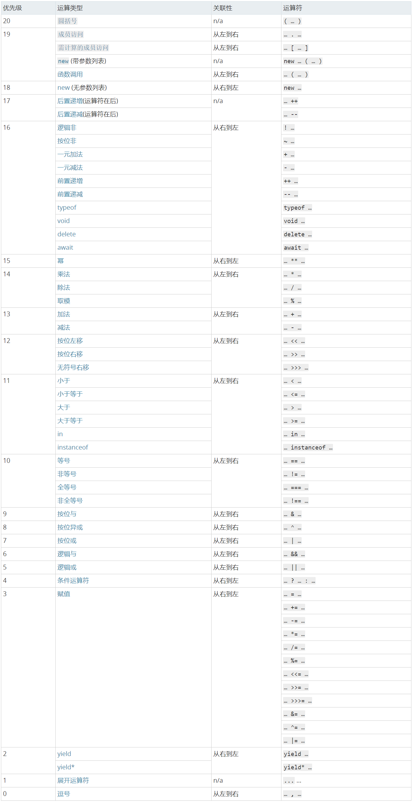

###自执行函数的遗留问题------------已解决，条件判断语句为false，所以里边的代码一句都不会执行

> 自执行函数中的输出语句（console.log(),alert()，等语句为什么不执行）；
> 
	~ function() {
		/*
		 * 变量提升：
		 *   function g;  //=>g是私有变量
		 */
		//if(g() && [] == ![]) { //=># **`Uncaught TypeError: g is not a function （此时的g是undefined） #**`
			/*
			 变量提升 g ;//自执行函数的私有作用域 g=undefined
			 * */
		if(g && [] == ![]) {//(undefined && [] == ![]),也就是(false或true == false)  
			//=>[]==![]：TRUE
			//console.log("自执行函数中执行f():"+f());//代码不执行？
			//console.log("自执行函数中执行g():"+g());//代码不执行？
			alert(this);
			f = function() {//私有变量里没有f,所以修改的是全局的f
				return false;
			}; //=>把全局中的f进行修改 window.f=...（FALSE）
			function g() {////私有变量里有g,所以修改的是当前私有作用域里的g,呃呃呃不对，应该说是给私有变量g赋值
				return true;
			}
		}
	}();
	console.log(f());
	console.log(g());

为甚么？
原因，条件判断语句里的 (运算符的优先级) 搞错了

> @(示例笔记本)[马克飞象|帮助|Markdown]
 
####运算符的优先级
> 

