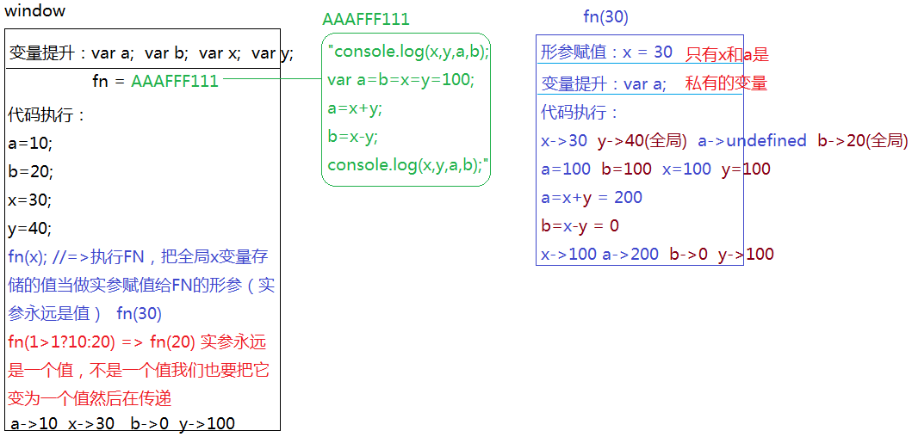

##JS中的 变量提升、作用域、闭包 核心原理解读
@(201712)

###数据类型的操作原理
`基本数据类型`
```javascript
var a=12;
var b=a;
b=13;
console.log(a); //=>12
```
> 直接在当前作用域中创建了基本数据类型的值（或者说基本类型值直接存储在当前作用域中），然后把这个值和变量关联起来（一个变量只能关联一个值，关联下一个值后和之前关联的值就没关系了），我们把关联这个操作叫做 **变量赋值**，基本数据类型是直接 **按值操作** 的

`引用数据类型`
```javascript
var o={name:'珠峰培训'};
var p=o;
p.name='中国最权威的前端培训机构';
console.log(o.name);
```
> 引用数据类型不是直接按值操作的（它的结构复杂，要存储很多值，无法直接的创建值），在JS中遇到引用数据类型（对象或者函数），按照如下操作进行：
> 
> 1、首先开辟一个新的内存空间（浏览器为其分配一个16进制的地址）
> 2、把需要存储的内容存储到内存空间中
> - 对象是把键值对依次存储到空间中
> - 函数是把函数体中的代码当做 '字符串' 存储到内存中
> 
> 3、把空间的地址赋值给对应的变量，所以我们也说：引用数据类型是**按照空间的引用地址操作**的

```javascript
function fn(){
	var total=null;
	total=1+1;
	return total;
}
fn();
fn();
...
```
> 函数执行的时候也有属于自己的一系列操作
> 1、函数执行首先会形成一个**新的私有作用域**，目的是为函数体中的代码提供一个执行的环境（而且这个环境是私有的）
> 2、把创建时候存储的代码字符串copy一份到自己的私有作用域中，然后把字符串转换为JS表达式，再然后依次自上而下执行
>  
> **[总结]**
> 每一次执行函数都是形成一个新的私有作用域，然后把代码重新自上而下执行（一切都从新开始），所以多次执行函数之间是没有直接联系的，互不干扰；
>  
> 函数执行形成的私有作用域，保护了里面的私有变量不受外界的干扰，我们把函数执行的这种保护机制叫做 **闭包**（如果当前变量是私有的，那么在函数体中出现的所有这个变量都和外界没有任何关系）

`全局作用域`
> 浏览器渲染页面（渲染页面中的JS）的时候，会提供一个供代码执行的环境 =>**全局作用域**(window/global)


###堆内存 & 栈内存
> JS中的内存一共两种：堆内存和栈内存

`堆内存`
> 作用：用来存储引用数据类型值的内存空间叫做堆内存（对象存储的是键值对，函数存储的是代码字符串）
>  
> 形成：只要遇到对象/数组/正则/函数等引用类型的值，浏览器首先第一步就是创建一个堆内存...
>  
> 释放：如果当前的堆内存被变量（或者函数以及元素事件等）占用了（占用了：堆内存地址赋值给变量了），此时的堆内存是有用的，不能销毁；我们想要手动释放堆内存，只需要让存储地址的变量等于其它值即可（最好等于null，null是空对象指针，本意就是不指向任何的堆内存）；
```javascript
var o={name:'珠峰培训'};//<=> o=AAAFFF000
o=null;//=> 此时堆内存不被占用，浏览器会在空闲的时间，把所有不被占用的堆内存进行自动回收释放（谷歌浏览器的机制，IE浏览器是靠计数器来统计当前堆内存被占用的次数：当计数器统计为零次，说明没有人占用它，浏览器销毁这个堆内存）
```

`栈内存`
> 作用：又称为作用域，目的就是提供JS代码执行的环境（供代码执行的），基本数据类型值都是直接的存储在栈内存中
>  
> 全局作用域（栈内存）：
> 形成：浏览器渲染页面，首先就会形成一个全局作用域
> 销毁：关闭当前页面（F5刷新页面：先把页面关闭，然后再重新打开）
>  
> 私有作用域（栈内存）：
> 形成：函数执行会形成私有的作用域
> 销毁：一般情况下，函数体中的代码执行完成，形成的栈内存会立即释放；当然也有不释放的情况，后面再详细来讲。

###变量提升（预解释）
> 在`当前作用域`中，JS代码自上而下执行之前，浏览器首先会把所有带`var/function`关键字的，进行提前的`声明(declare)/定义(defined)`，这种提前声明变量的机制，我们称之为`变量提升`
>  
> 1、变量提升只对当前作用域下的变量或者函数起作用
> 2、带var的在变量提升阶段只是提前的声明（告诉当前作用域有这个变量了而已）
> 3、带function关键字的，在变量提升阶段不仅仅是声明，而且还定义了（定义：其实就是赋值的操作）
```javascript
console.log(total);//=>不会报错：变量提升阶段已经告诉全局有一个total了，只声明没有定义，默认值undefined
//fn();//=>可以执行：变量提升阶段就已经完成了fn的声明和赋值操作,此时的fn已经是一个函数了

function fn(num1,num2){
	var total=null;
	total=num1+num2;
	return total;
}//->代码执行遇到此处直接跳过：变量提升阶段已经完成过一次了
var total=fn(10,20);//->给total赋值：变量提升阶段只是完成了它的声明，没有赋值，所以代码执行到这一步需要赋值
console.log(total.toFixed(2));
```


> 函数执行会形成一个新的私有作用域，和全局作用域一样，进来的第一步不是代码执行，私有作用域和全局也有一些区别：私有作用域进来的第一步也不是变量提升
> 
> 第一步：如果有形参，第一步是形参赋值
> 第二步：变量提升
> 第三步：代码自上而下执行
>  
> [私有变量]
> `形参`和`在私有作用域中声明的变量（函数）`都是私有的，和外界的其它变量互不干扰

###作用域链
> 函数执行形成私有作用域，在私有作用域中出现的变量可能是私有的，有可能不是自己私有的，私有和非私有我们的操作步骤是不一样的
>  
> [ 私有的 ]
> 如果是私有的，和外面的就没有任何的关系了，以后在函数体中操作的当前变量都按照私有的处理
>  
> [ 非私有的 ]
> 不是自己私有的，首先向其上级作用域查找，如果也不是上级作用域私有的，则继续向上查找，一直到window全局作用域为止，我们把这种查找机制称为**`作用域链`**
```javascript
var a=10,b=20,x=30,y=40;
function fn(x){
	console.log(x,y,a,b);
	var a=b=x=y=100;
	a=x+y;
	b=x-y;
	console.log(x,y,a,b);
}
fn(x);
console.log(x,y,a,b);

/*
 var a=10,b=20;
 <=>
 var a=10;
 var b=20;
 
 var a=b=20;
 <=>
 var a=20;
 b=20;
*/
```


###查找上级作用域
> 当前函数的上级作用域和它在哪执行的没有关系，只和它在哪定义的有关系：在哪个作用域下定义的，那么它的上级作用域就是谁
```javascript
var n=10;
function fn(){
	console.log(n);
}
fn();//=>10

~function(){
	var n=100;
	fn();//=>10 和在哪执行没关系,FN是在全局下定义的，它的上级作用域是全局作用域，当前自执行函数形成的私有作用域仅是它的‘宿主环境’
}();
```

###不释放的栈内存
> 一般情况下，函数执行完成，形成的私有作用域都会自动释放；
>  
> 但是有很多时候，函数执行完，形成的作用域（栈内存）无法释放：`当前私有栈内存中的某些东西被栈内存以外的其它内容占用了`
>  
> 当我们手动把栈内存以外占用其内容的东西清除掉（或者不让其在占用了），之前没有销毁的栈内存会在浏览器空闲的时候自动销毁释放
```javascript
var obj={
	name:'珠峰培训',
	fn:(function(){
		var i=10;
		return function(){
			i++;
			console.log(i);
		}
	})()//=>如果传obj.name会报错：因为此时键值对还没有完全存储到堆内存中呢，obj和堆内存还没有关系呢，obj=undefined (错误：Cannot ready property 'name' of undefined)
};
obj.fn();
obj.fn();
...


//var obj={name:'xxx'};
//obj.fn=(function(){})(obj.name); 这样是可以的，因为此时的obj已经和堆内存关联在一起了
```


`i++和++i`
> i++：先去拿原有的值和别人运算，运算完成后自身累加1
> ++i：先自身累加1，累加后，拿最新的结果和别人运算
```javascript
var i=4;
console.log(10+(i++)); //=>14
console.log(i); //=>5

i=4;
console.log(10+(++i)); //=>15
console.log(i); //=>5
```

`案例练习`
```javascript
var i = 0;
function fn() {
    i += 2;
    return function (n) {
        console.log(n + (++i));
    }
}
var f = fn(3);
f(4);
fn(5)(6);
f(7);
fn(8)(9);
```


###this
> 在js中this代表当前函数执行的主体（谁执行的这个函数）
>  
> this是谁和函数在哪定义以及在哪执行的，都没有任何关系

```javascript
function fn(){
	console.log(this);
}
var obj={name:'珠峰培训',fn:fn};
obj.fn();//->this:obj
fn();//->this:window  <=> window.fn();
```

`1、自执行函数中的this一般都是window`
```javascript
var obj={
	name:'珠峰培训',
	fn:(function(){
		console.log(this);//->window(全局对象也可以叫做浏览器对象)
		return function(){}
	})()
};
```

`2、给元素的某个事件绑定方法，事件触发方法被执行，此时方法中的this一般都是当前操作元素本身`
```javascript
oBox.onclick=function(){
	//->当触发点击事件，执行这个匿名函数的时候，方法中的 this:oBox
}
```

`3、方法执行看方法名前面是否有点，有点，点前面是谁，方法中的this就是谁，没有点，方法中的this就是window`
```javascript
function fn(){
	console.log(this);
}
var obj={name:'珠峰培训',fn:fn};
obj.fn();//->this:obj
fn();//->this:window
```

`4、以上三条都是限定在非严格模式下，在JS严格模式下，上述部分需要换一下`
> 不指定执行主体，this是undefined而不是之前非严格模式下默认的window
```javascript
~function(){ 
	//this->window 
}();
fn(); //->fn中的this:window
```

```javascript
"use strict";//=>放在JS代码第一行（一定要是当前作用域第一行），让整个JS开启严格模式
~function(){ 
	//this->undefined
}();
fn(); //->fn中的this:undefined
window.fn(); //->fn中的this:window
```

###综合练习
```javascript
var num = 10;
var obj = {num: 15};
obj.fn = (function (num) {
    this.num += 10;
    num *= 2;
    return function (n) {
        this.num += n;
        console.log(n + (--num));
    }
})(obj.num);
var fn = obj.fn;
fn(10);
obj.fn(15);
console.log(window.num, obj.num);
```


###闭包汇总
> 函数执行，形成一个私有作用域，保护里面的私有变量不受外界的干扰，这种保护机制叫做 **闭包**
>  
> 但是现在市面上，99%的IT开发者都认为：函数执行，形成一个不销毁的私有作用域，除了保护私有变量以外，还可以存储一些内容，这样的模式才是闭包  

```javascript
var utils=(function(){
	
	return {
		
	}	
})();
```

> 闭包作用：
> 1、保护
> 团队协作开发，每个开发者把自己的代码存放在一个私有的作用域中，防止相互之间的冲突；把需要供别人使用的方法，通过return或者window.xxx暴露在全局下即可；
>  
> jQuery源码中也是利用保护机制实现的
```javascript
~function(){
	var jQuery=function(){
		...
	}
	...
	window.$=window.jQuery=jQuery;	
}();
```

> 2、保存
> 选项卡闭包解决办法
>  
> 单例模式（JS高阶编程技巧：惰性思想/柯理化函数思想...）