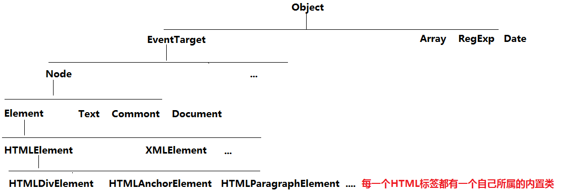
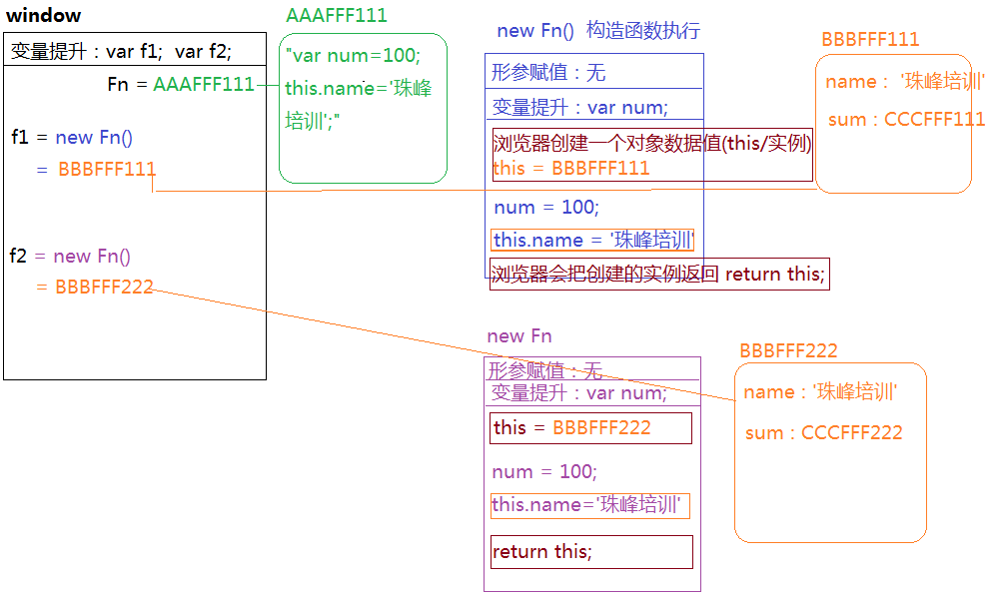

##JS中的面向对象（OOP）
@(201712)

###单例模式
> 在真实项目中，为了实现模块化开发或者团队协作开发，我们经常应用单例模式（一般业务逻辑部分的代码都是依托单例模式设计规划的）

`单例模式的由来`
> long long ago~~ ，JS中都是值类型，没有引用数据类型
```javascript
var name='李芙蓉';
var age=13;
var sex='女神';

var name='赵淼';
var age=81;
var sex='未知';

//=>如果后面编写的代码，创建的变量或者函数名和之前的一样，会把之前存储的值替换掉；真实项目中，团队协作开发，如果是这样来处理，经常会导致相互代码的冲突：`全局变量污染` `全局变量冲突`
```
> 后来JS中诞生了对象数据类型，解决了上面出现的污染或者冲突问题
```javascript
//=>把描述同一件事务的特征或者属性，进行归纳汇总（放在一起），以此来避免全局变量之前的冲突
var person1={
	name:'李芙蓉',
	age:13,
	sex:'小仙女'
};

var person2={
	name:'赵淼',
	age:81,
	sex:'看着办'
};
person1.age
person2.name
```
> 我们把对象数据类型实现 `把描述同一件事务的属性或者特征归纳汇总在一起，以此避免全局变量冲突问题` 的方式和思想叫做：**`单例设计模式`**
```javascript
//=>单例模式
//1、singleton不仅仅是对象名了，在单例模式中，singleton称之为 “命名空间(nameSpace)”
var singleton={
	xxx:xxx,
	...
};

var singleton={
	nameSpace1:{
		xxx:xxx,
		...
	},
	nameSpace2:{
		xxx:xxx,
		...
	}
	...
};
```
> 把描述同一件事务的属性或者方法存放在某一个命名空间下，多个命名空间中的属性和方法是互不干扰的

###使用单例模式实现模块化开发
> 模块化开发：在团队协作开发的时候，我们经常会把一个复杂页面，按照具体的功能划分成为几大块，然后分别去开发，这种模块划分的思想就是模块化开发思想
>  
> 真实项目中，我们可以使用单例模式（建议也是使用单例模式）来实现模块化开发

```javascript
//=>项目主管（开发人员）：公共模块
var utils={
	trim:function(){}
};

//=>陆永勇：搜索模块
var searchModel={
	submit:function(){
		utils.trim();
	},
	...
};

//=>唐元帅：天气模块
var weatherModel={
	setWeather:function(){},
	...
};

//=>陈金广：频道模块
var channelModel={
	show:function(){
		//=>在当前的命名空间下调取其它命名空间的方法：指定好对应的命名空间名字即可，使用 [NameSpace].[property] 就可以操作了
		searchModel.submit();

		//=>调取本模块中的一些方法，可以直接使用THIS处理即可：此方法中的THIS一般都是当前模块的命名空间
		this.setChannel();
	},
	setChannel:function(){},
	...
};
channelModel.show();
```

###高级单例模式
> 基于JS高阶编程技巧`惰性思想`来实现的单例模式，并且可以把一些常用的设计模式（例如：`命令模式、发布订阅设计模式、promise设计模式`等）融合进来，最后清晰的规划我们的业务逻辑代码，方便后期二次开发和维护，这种设计思想综合体就是高级单例模式，也是项目中最常应用的
```javascript
var searchModel=(function(){
    var $searchPlan=$.Callbacks();
    
	function submit(){
		...
	}
	$searchPlan.add(submit);
	
	function fn(){
		...
	}
	$searchPlan.add(fn);
	
	return {
		init:function(){
			$searchPlan.fire();
		}	
	}
})();
searchModel.init();
```

###面向对象（OOP）
> 面试对象是编程思想（面向过程编程思想：C语言是面向过程的），JAVA、PHP、C#、C++、.net(dot net)、JS...这些都是面向对象编程的
>  
> HTML和CSS是标记语言不是编程语言，没有所谓的面向对象编程
> 后期学习的LESS/SASS属于CSS预编译语言，旨在把CSS变为编程语言（面向对象）

`对象、类、实例`
> 对象：编程语言中的对象是一个泛指，万物接对象（我们所要研究学习以及使用的都是对象）
> 类：对象的具体细分（按照属性或者特性细分为一些类别）
> 实例：某一类中具体的事物
> 
> [实际生活中]
> 自然界中万物皆对象，我们为了认知自然界，我们会把自然界中的事物按照特征进行分类，例如：
> - 动物类
>    + 人类
>        + 正常人类
>        + 程序猿类
>    + 爬行动物类
>    + 哺乳动物类
>    + ...
> - 植物类
> - 微生物类
> - ...
> 
> 周老师就是程序猿类别中的一个实例

----
> JS本身就是基于面向对象创造出来的语言（所以它是面向对象编程），我们想要学习JS，首先也是给其进行分类，我们拿出某一类中的实例，进行学习和研究

###JS中常用的内置类
- 关于数据类型的
	+ Number：每一个数字或者NaN是它的一个实例
	+ String：字符串类
	+ Boolean：布尔类
	+ Null
	+ Undefined：浏览器屏蔽了我们操作Null或者Undefined这个类
	+ Object：对象类，每一个对象数据类型都是它的实例
		+ Array：数组类
		+ RegExp：正则类
		+ Date：日期类
		+ ...
	+ Function：函数类，每一个函数都是它的一个实例
- 关于元素对象和元素集合的
	+ HTMLCollection：元素集合类 
	+ NodeList：节点集合类
	+ HTMLDivElement
	+ HTMLElement
	+ Element
	+ Node
	+ EventTarget
	+ ...



```javascript
//=>元素集合类
getElementsByTagName
getElementsByClassName
querySelectorAll

//=>节点集合类
getElementsByName
childNodes
```


###目前阶段学习面向对象对于我们的意义
> 研究数组：
> 1、创建一个数组类的实例，研究其基础语法和结构
> 2、如果想要研究数据具备的功能方法，我们只需要看Array/Object这些类上都赋予了它什么样的方法
> 
> [问题]
> document.getElementById它的上下文只能是document，其它不可以？
> 
> 因为getElementById这个方法只有Document这个类才有，其它的类没有，所以只有document这个作为Document的实例才能使用这个方法

###基于面向对象创建数据值
```javascript
//var ary=[12,23];//=>字面量创建方式

//=>严谨的基于面向对象(构造函数)方式创建一个数组
var ary=new Array();
/*
 * 两种创建方式在核心意义上没有差别，都是创建Array这个类的一个实例，但是在语法上是有区别的
 * 1、字面量创建方式传递进来什么，都是给数组每一项加入的内容
 * 
 * 2、构造函数创建方式
 * new Array(10)：创建一个长度为10的数组,数组中的每一项都是空
 * new Array('10')：如果只传递一个实参，并且实参不是数字，相当于把当前值作为数组的第一项存储进来
 * new Array(10,20,30)：如果传递多个实参，不是设置长度，而是把传递的内容当做数组中的每一项存储起来
*/

var obj={name:'珠峰培训'};
var obj=new Object();//=>一般只用于创建空对象，如果需要增加键值对，创建完成后自己依次添加即可

//-------------------
var num=12;//=>字面量创建出来的是一个基本数据类型值（但是也是Number的一个实例，可以调取Number赋予它的方法）
//num.toFixed：就是Number赋予它的方法

var num=new Number(12);//=>构造函数方式创建出来的也是Number的一个实例（也可以使用Number赋予它的方法）, 但是获取的结果是对象数据类型的
```

###构造函数设计模式（constructor）
> 使用构造函数方式，主要是为了创建类和实例的，也就是基于面向对象编程思想来实现一些需求的处理
>  
> 在JS中，当我们使用 `new  xxx()` 执行函数的时候， 此时的函数就不是普通的函数了，而是变为一个类，返回的结果叫做当前的类的实例，我们这种 new xxx 执行的方式称之为 `构造函数设计模式`
```javascript
function fn(){
	...
}
var f=new fn();//=>fn是一个类，f是当前这个类的一个实例 “构造函数设计模式” （我们一般都会把类名第一个字母大写）
```

`普通函数执行 VS 构造函数执行`
> 普通函数执行
> 1、开辟一个新的私有作用域
> 2、形参赋值
> 3、变量提升
> 4、代码自上而下执行（return后面的值就是当前函数返回的结果）
> 5、栈内存释放或者不释放问题

```javascript
function fn(num){
	this.num=num;//=>this:window 给全局对象增加一个num的属性名，属性值是10
	var total=null;
	total+=num;
	return total;
}
var f=fn(10);//=>f:10
```
> 构造函数执行
> 1、首先和普通函数执行一样，也需要开辟一个新的私有作用域
> 2、在私有作用域中完成类似于普通函数的操作：形参赋值以及变量提升
> 3、在代码自上而下执行之前，构造函数有属于自己比较特殊的操作：`浏览器会在当前的作用域中默认创建一个对象数据类型的值，并且会让当前函数中的this指向创建的这个对象`
> 4、像普通函数一样，代码自上而下执行：`this.xxx=xxx这里操作都是在给创建的这个对象增加属性名和属性值`
> 5、代码执行完成后，即时函数中没有写return，在构造函数模式中：`浏览器会默认的把创建的对象返回到函数的外面`
>  
> 构造函数执行，即具备普通函数执行的一面，也同时具备自己独有的一些操作；
> `在构造函数执行期间，浏览器默认创建的对象（也就是函数体中的this）就是当前这个类的一个实例，浏览器会把默认创建的实例返回，所以我们说：new Fn()执行，Fn是一个类，返回的结果是Fn这个类的一个实例`
> 
```javascript
function Fn(num){
	//=>在构造函数模式中，方法体中出现的THIS是当前类的一个实例（this.xxx=xxx都是在给当前实例增加一些私有的属性）
	this.num=num;
}
var f = new Fn(10);
```

`深入理解构造函数执行的步骤`
> 当构造函数或者类，执行的时候不需要传递任何的实参值，此时我们是否加小括号就不重要了（不传递实参的情况下，小括号可以省略）
>  
> 构造函数执行，同时具备了普通函数执行的一面，也有自己特殊的一面，但是和实例相关的，只有自己特殊的一面才相关（也就是 this.xxx=xxx才相当于给当前实例增加的私有属性），函数体中出现的私有变量，和实例都没有直接的关系
>  
> 通过类创建出来的每一个实例都是单独的个体（单独的堆内存空间），实例和实例之间是不相同并且独立互不影响的（市面上部分开发把这种模式叫做单例模式，这种说法是错的，JS中的这种模式叫做构造函数设计模式）
>  
> 在构造函数体中，通过this.xxx=xxx给实例设置的属性都是当前实例的`私有属性`
```javascript
function Fn(){
	var num=100;
	this.name='珠峰培训';
	this.sum=function(){};
}
var f1 = new Fn();
var f2 = new Fn;

//=>私有变量和实例没关系
console.log(f1.num);//=>undefined
console.log(f1.name);//=>'珠峰培训'

//=>不同实例是不同的空间地址
console.log(f1===f2);//=>false
console.log(f1.sum===f2.sum);//=>false
```
> 当构造函数体中我们自己手动的设置了RETURN（默认返回的是实例:对象类型值）, RETURN 的是一个基本类型值，对最后返回的实例没有任何的影响，但是如果返回的是引用数据类型的值，会把默认返回的实例替换掉；
```javascript
function Fn(){
	this.name='珠峰培训';
	return 10;
}
var f = new Fn();//=>f依然是当前类的一个实例

function Fn(){
	this.name='珠峰培训';
	return {name:'xxx'};
}
var f = new Fn();//=>f不再是Fn的实例，而是变为手动返回的对象了
```


###instanceof
> 用来检测当前实例是否隶属于某个类
```javascript
function Fn(){}
var f = new Fn;
console.log(f instanceof Fn);//=>true
```
> instanceof解决了typeof无法识别是数组还是正则的问题
```javascript
[] instanceof Array  //=>true
/^$/ instanceof Array //=>false
```

###hasOwnProperty VS in
> in：用来检测当前这个属性是否隶属于对象（不管是对象私有的还是公有的属性，只要有返回的就是true）
>  
> hasOwnProperty：用来检测当前这个属性是否是对象的私有属性（不仅要是对象的属性，而且需要是私有的才可以）
```javascript
var obj={name:'珠峰培训',age:8};
'name' in obj  //=>true
'sex' in obj   //=>false
'hasOwnProperty' in obj //=>true  hasOwnProperty是Object这个内置类中提供的属性方法，只要当前对象是Object的一个实例，就可以使用这个方法

obj.hasOwnProperty('name') //=>true
obj.hasOwnProperty('hasOwnProperty') //=>false
```
> 检测一个属性是否是当前对象的公有属性
> 1、是对象的一个属性
> 2、不是对象的私有属性
```javascript
function hasPubProperty(attr,obj){
	return (attr in obj) && (obj.hasOwnProperty(attr)===false);
}
hasPubProperty('hasOwnProperty',{xxx:'xxx'});
```

###JS中的对象和函数汇总
> 对象数据类型的值
> - {} 普通对象
> - [] 数组
> - /^$/ 正则
> - Math 数学函数
> - 一般类的实例都是对象数据类型的
> - 函数的prototype属性
> - 实例的\__proto__属性
> - ...
>  
> 函数数据类型值
> - 普通函数
> - 所有的类（内置类和自定义类）
> - ...


###原型
> 1、所有的函数都天生自带一个属性：prototype（原型）, 它是一个对象数据类型的值，在当前prototype对象中，存储了类需要给其实例使用的公有的属性和方法
> 
> 2、prototype这个对象，浏览器会默认为其开一个堆内存，在这个堆内存中天生自带一个属性：constructor（构造函数），这个属性存储的值就是当前函数本身
>  
> 3、每一个类的实例（每一个对象）都天生自带一个属性：\__proto__，属性值是当前对象所属类的原型（prototype）

```javascript
function Fn(name,age){
	this.name=name;
	this.age=age;
	this.say=function(){
		console.log('my name is '+this.name+' !i am '+this.age+' years old!');
	}
}
Fn.prototype.say=function(){
	console.log('hello world~');
};
Fn.prototype.eat=function(){
	console.log('i love food~');
};
var f1=new Fn('王燕燕',19);
var f2=new Fn('王雪超',69);
```