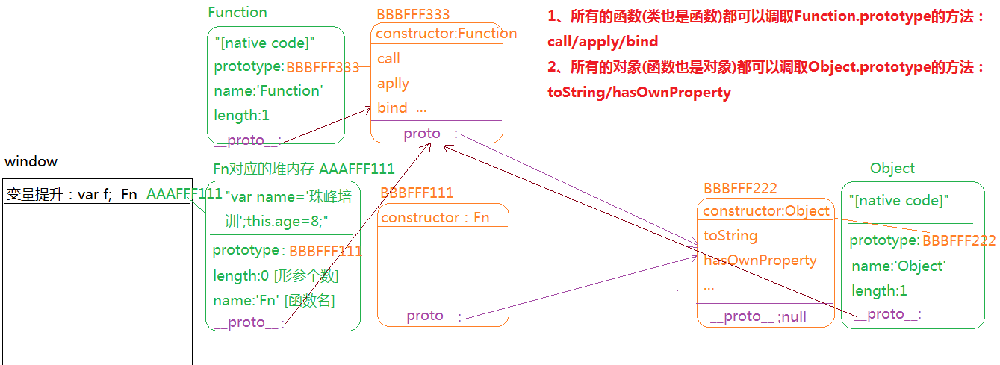
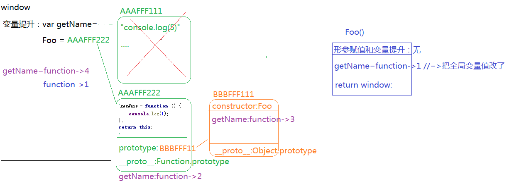

##面向对象深入解读
###函数的三种角色
> **第一种角色：普通函数**
> 栈内存(私有作用域)
> 作用域链
> 形参
> arguments
> return
> ...
> 
> **第二种角色：类**
> 类
> 实例
> 私有和公有属性
> prototype
> \__proto__
> ...
> 
> **第三种角色：普通对象**
> 键值对操作
> ... 
>  
> 三种角色之间没有直接的关系
```javascript
function Fn(){
	var name='珠峰培训';
	this.age=8;
}
Fn.prototype.say=function(){}
Fn.eat=function(){}
var f = new Fn();
```


> 阿里超经典面试题（有难度）
```javascript
function Foo() {
    getName = function () {
        console.log(1);
    };
    return this;
}
Foo.getName = function () {
    console.log(2);
};
Foo.prototype.getName = function () {
    console.log(3);
};
var getName = function () {
    console.log(4);
};
function getName() {
    console.log(5);
}

Foo.getName();
getName();
Foo().getName();
getName();
new Foo.getName();
new Foo().getName();
new new Foo().getName();
```


###call  apply bind
> 都是天生自带的方法(Function.prototype)，所有的函数都可以调取这三个方法
> `三个方法都是改变THIS指向的`

`call`
> fn.call(context,para1,...)
> 把fn方法执行，并且让fn方法中的this变为context,而para1...都是给fn传递的实参
```javascript
//=>非严格模式
function fn(num1,num2){
	console.log(this);
}
var obj={fn:fn};
fn();//=>this:window
obj.fn();//=>this:obj

var opp={};
//opp.fn();//=>报错:opp中没有fn这个属性
fn.call(opp);//=>this:opp num1&&num2都是undefined
fn.call(1,2);//=>this:1 num1=2 num2=undefined
fn.call(opp,1,2);//=>this:opp num1=1 num2=2

//->CALL方法的几个特殊性
fn.call();//=>this:window   num1&&num2都是undefined
fn.call(null);//=>this:window
fn.call(undefined);//=>this:window
```

```javascript
//=>JS严格模式下
"use strict";
fn.call();//=>this:undefined
fn.call(undefined);//=>this:undefined
fn.call(null);//=>this:null
```

`apply`
> apply的语法和call基本一致，作用原理也基本一致，唯一的区别：apply把传递给函数的实参以数组形式存放（但是也相当于在给函数一个个的传递实参值）
```javascript
fn.call(null,10,20,30);
fn.apply(null,[10,20,30]); //=>传递给fn的时候也是一个个的传递进去的
```

`bind`
> 也是改变THIS的方法，它在IE6~8下不兼容；它和call(以及apply)改变this的原理不一样
```javascript
fn.call(opp,10,20); //=>把fn执行,让fn中的this变为opp,并且把10&&20分别传递给fn

fn.bind(opp,10,20); //=>预先让fn中的this指向opp,并且把10和20预先传递给fn,此时的fn没有被执行(只有当执行的时候this和实参才会起到应有的作用)


//=>需求：点击box这个盒子的时候，需要执行fn，并且让fn中的this指向opp
oBox.onclick=fn; //=>点击的时候执行了fn,但此时fn中的this是oBox

oBox.onclick=fn.call(opp); //=>绑定事件的时候就已经把fn立即执行了(call本身就是立即执行函数),然后把fn执行的返回值绑定给事件

oBox.onclick=fn.bind(opp);
//=>fn.bind(opp)：fn调取Function.prototype上的bind方法，执行这个方法返回了一个匿名函数
/*
 * function(){
 *     fn.call(opp);
 * }
 */
oBox.onclick=function(){
	//=>this:oBox
	fn.call(opp);
}
```

> 思考题
```javascript
function fn1(){
	console.log(1);
}
function fn2(){
	console.log(2);
}
fn1.call(fn2);
fn1.call.call.call(fn2);
Function.prototype.call(fn2);
Function.prototype.call.call.call(fn2);
```

